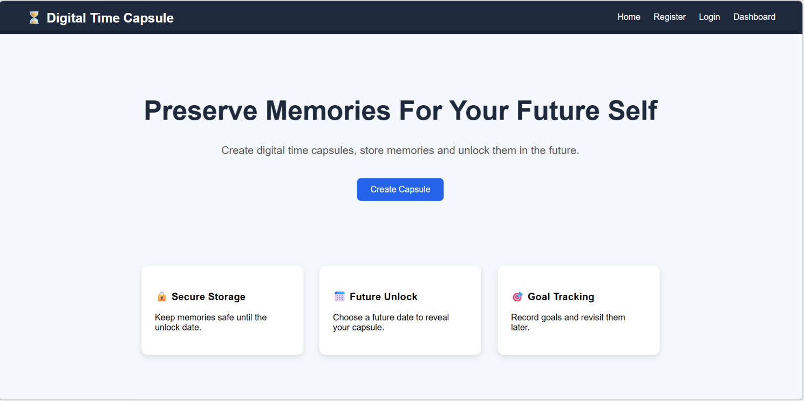
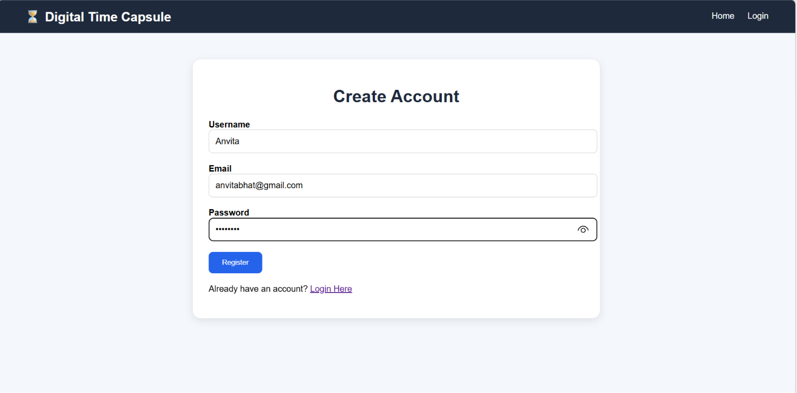
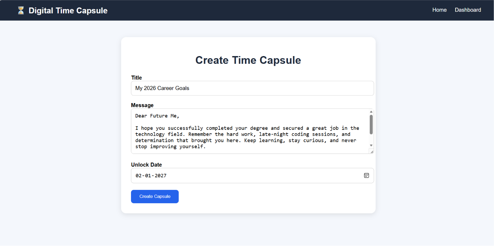
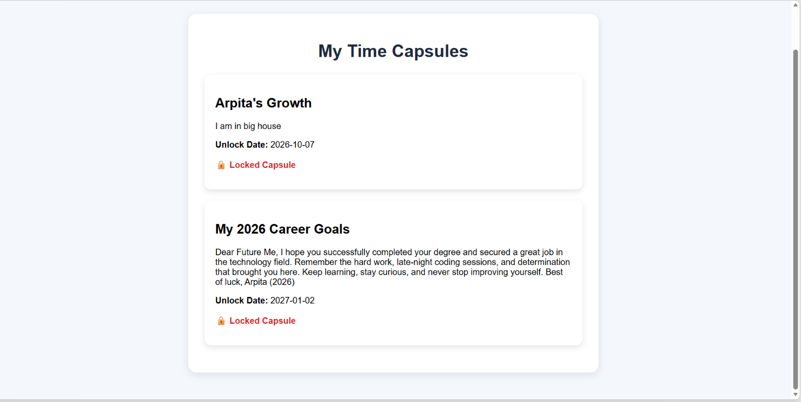

# ⏳ Digital Time Capsule

A web-based platform that allows users to create digital time capsules containing messages, goals, memories, and personal reflections, which remain locked until a chosen future date. Users can revisit their past thoughts, track personal growth, and reconnect with their aspirations over time.

🚀 Currently being developed as part of the Elite Coders Open Source Hackathon 2026.

---

## 📌 Problem Statement

People often set goals, make promises to themselves, and capture important moments, but these memories are scattered across notes, chats, and social media. There is no dedicated platform that securely stores personal reflections and reveals them at the right moment in the future.

Digital Time Capsule solves this problem by allowing users to preserve memories, messages, and goals that can only be accessed after a selected unlock date.

---

## ✨ Features

### Current Features
- User Registration & Login
- Create Digital Time Capsules
- Set Future Unlock Dates
- Secure Storage of Messages
- Personal Dashboard
- View Locked and Unlocked Capsules

### Planned Features
- Email Notifications on Unlock
- Public & Private Capsules
- Image Upload Support
- Audio & Video Time Capsules
- AI-Based Reflection Analysis
- Goal Achievement Tracking
- Capsule Sharing

---

## 🛠️ Tech Stack

### Frontend
- HTML5
- CSS3
- JavaScript

### Backend
- Python
- Flask

### Database
- SQLite

### Version Control
- Git
- GitHub

---

## 📂 Project Structure

```text
digital-time-capsule/
│
├── app.py
├── requirements.txt
├── README.md
│
├── static/
│   ├── css/
│   ├── js/
│
├── templates/
│   ├── login.html
│   ├── register.html
│   ├── dashboard.html
│   ├── create_capsule.html
│
├── database/
│   └── capsule.db
│
└── screenshots/
```

---

## 🚀 Getting Started

### Clone the Repository

```bash
git clone https://github.com/YOUR_USERNAME/digital-time-capsule.git
```

### Navigate to Project Folder

```bash
cd digital-time-capsule
```

### Install Dependencies

```bash
pip install -r requirements.txt
```

### Run the Application

```bash
python app.py
```

---

## 🎯 Future Scope

- End-to-end Encryption
- Cloud Storage Integration
- Mobile Application
- Social Time Capsules
- Community Memory Archive
- AI Memory Insights
- Scheduled Email Delivery

---

## 🤝 Contributing

Contributions, ideas, and suggestions are welcome.

1. Fork the repository
2. Create a feature branch
3. Commit your changes
4. Open a Pull Request

---

## Screenshots

### Home Page


### Register Page


### Create Capsule


### Dashboard



---

## 📄 License

This project is licensed under the MIT License.

---

## 👩‍💻 Author

**Arpita Gajanan Bhat**

Built with ❤️ during the Elite Coders Open Source Hackathon 2026.
